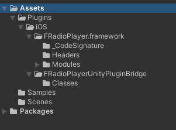
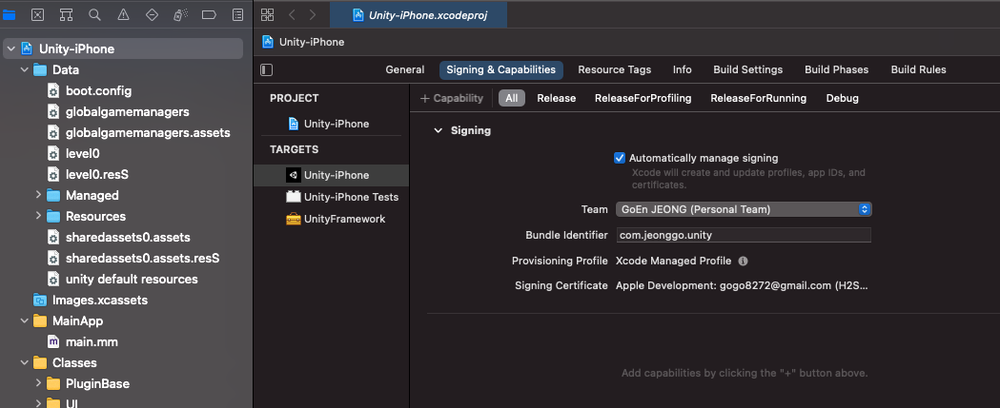
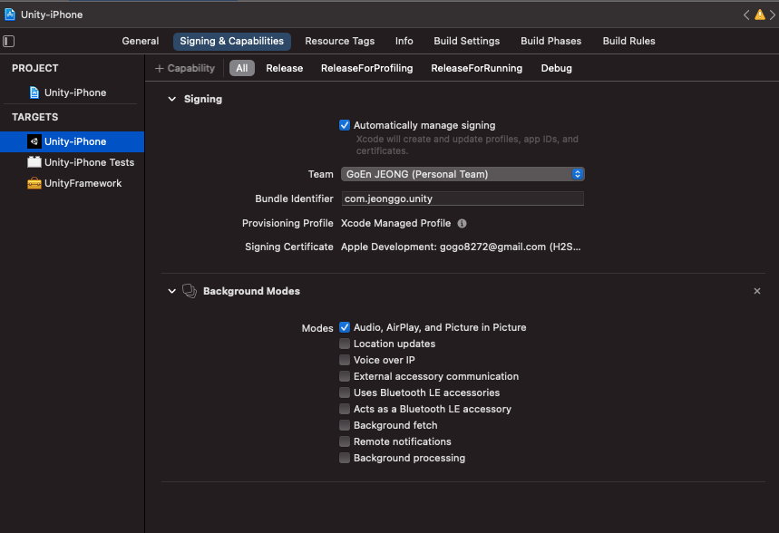

# FRadioPlayerUnityPlugin-unity

- 환경

Xcode 12.5

Unity 2019.4.29f1 

iOS 14.7인 iPhone XS에서 실험완료

- objc wrapper

```objective-c
    void __IOS_SetRadioURL(const char* str) {
        NSString *strNS = NSStringFromCString(str);
        [[FRadioPlayer shared] setRadioURL: [NSURL URLWithString:strNS]];
    }

    void __IOS_Play() {
        [[FRadioPlayer shared] play];
    }

    void __IOS_Stop() {
        [[FRadioPlayer shared] stop];
    }
```

- Unity

```csharp
        [DllImport("__Internal")]
        internal static extern void __IOS_SetRadioURL(string str);
        [DllImport("__Internal")]
        internal static extern void __IOS_Play();
        [DllImport("__Internal")]
        internal static extern void __IOS_Stop();
```

참고: [유니티용 Plugin 만들기 : iOS편 (Swift)](https://medium.com/sunriv/%EC%9C%A0%EB%8B%88%ED%8B%B0%EC%9A%A9-plugin-%EB%A7%8C%EB%93%A4%EA%B8%B0-ios%ED%8E%B8-swift-de97c8449012)

## 유니티 세팅하기

1. FRadioPlayer.framework와 FRadioPlayerUnityPluginBridge를 import한다.



2. 스크립트를 하나 만들고

```csharp
using System.Runtime.InteropServices;

// 클래스 내부
        [DllImport("__Internal")]
        internal static extern void __IOS_SetRadioURL(string str);
        [DllImport("__Internal")]
        internal static extern void __IOS_Play();
        [DllImport("__Internal")]
        internal static extern void __IOS_Stop();
```

__IOS_SetRadioURL("asdf"); 

이렇게 해서 호출하면 됨.

3. 라디오 설정하는 법
   1. __IOS_SetRadioURL(""); 으로 라디오의 url string을 넣어준다. (주의) 설정하면 자동재생 값이 true인지라 자동으로 바로 재생 시작된다..
   2.  __IOS_Play(); 으로 플레이
   3. __IOS_Stop(); 으로 스탑

## Xcode 설정하기

1. provisioning profile 설정



2. Signing 위의 + Capability 버튼 누르고 BackgroundModes 추가 후 Audio 모드 클릭



[FRadioPlayerUnityPlugin-ios](https://github.com/Goeun1001/FRadioPlayerUnityPlugin-ios)

